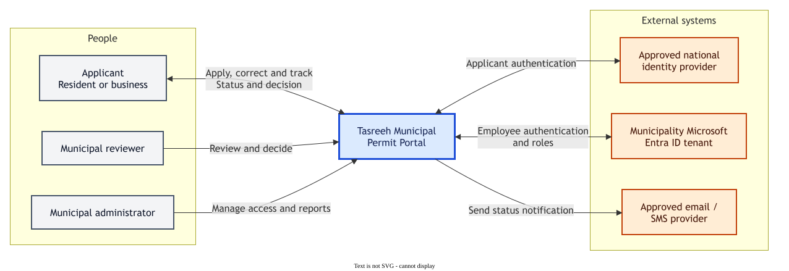
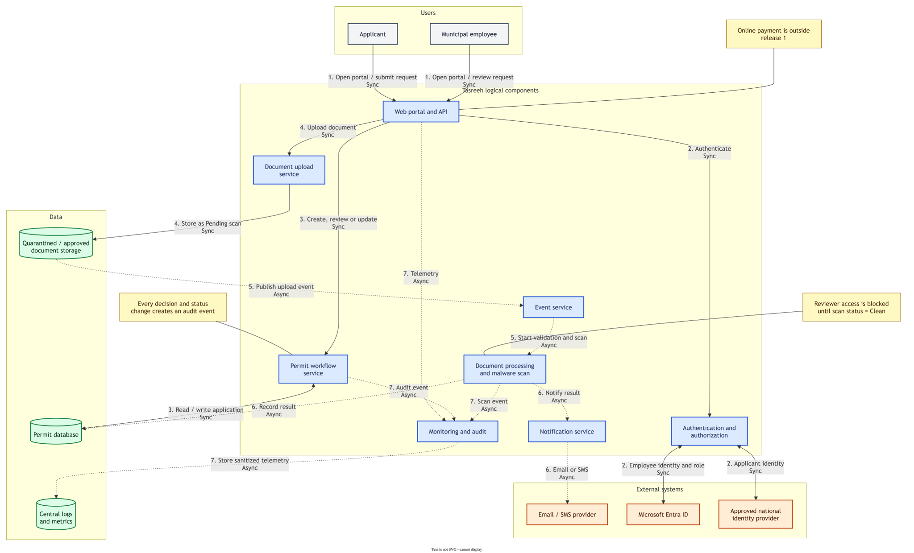
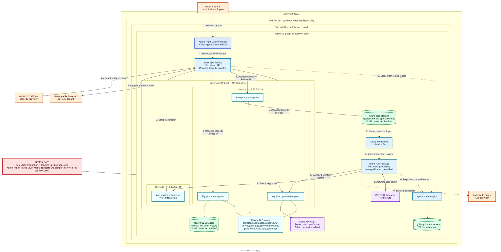

# Tasreeh Municipal Permit Portal — Solution Architecture Document (SAD Lite)
Team: Ibrahim, Marwan and Abdullah | Version: 1.0 | Date: 2026-09-27

## 1. Summary
This system helps residents and businesses apply for municipal permits, upload supporting documents, and track approval decisions online. Municipal employees use the same platform to review applications, request corrections, and approve or reject permits. It runs on Azure App Service with Azure SQL Database and Blob Storage in UAE North for development and production-like testing with synthetic data only. Real-data production will move to an approved Azure region inside Saudi Arabia before go-live. The planning estimate is about 5,500 SAR per month in production. The main risk is that an approved in-Kingdom Azure region may not support every required service by the planned go-live date.

## 2. Scope
In scope:
- Arabic and English web portal for residents and businesses to create and submit permit applications.
- Secure upload, malware scanning, and storage of permit drawings and supporting documents.
- Municipal workflow to review applications, request corrections, approve or reject permits, and retain an audit history.
- Email or SMS notifications when an application status changes.

Out of scope:
- Online payment and integration with a payment gateway in the first release.
- Mobile applications, field-inspection scheduling, and migration of historical paper applications.

## 3. Requirements

| ID | Requirement | Source |
| --- | --- | --- |
| FR-01 | An applicant must be able to sign in through the approved national identity provider and create a permit application. | Client interview |
| FR-02 | An applicant must be able to save a draft, complete required fields, and submit an application. | Client interview |
| FR-03 | An applicant must be able to upload PDF, JPG, or PNG supporting documents up to 20 MB per file, and every file must be malware-scanned before a reviewer can open it. | Client interview |
| FR-04 | An applicant must be able to view application status and receive an email or SMS when the application is submitted, returned for correction, approved, or rejected. | Client interview |
| FR-05 | A municipal reviewer must be able to search assigned applications, review their details and documents, request corrections, approve, or reject with a recorded reason. | Client interview |
| FR-06 | A municipal administrator must be able to manage reviewer access, view operational reports, and retrieve an immutable audit history for each application. | Client interview |
| NFR-01 | The production portal must achieve 99.9% availability each calendar month, measured by Application Insights availability tests. | Client interview |
| NFR-02 | At least 95% of normal page and API requests must complete within 2 seconds at 500 concurrent users, measured by Application Insights. | Client interview |
| NFR-03 | The portal must acknowledge an upload within 5 seconds and complete malware scanning within 2 minutes for a file up to 20 MB, measured by end-to-end monitoring. | Client interview |
| NFR-04 | The service must meet an RTO of 4 hours and an RPO of 15 minutes, demonstrated by a recovery exercise at least twice per year. | Client interview |
| NFR-05 | All applicant and employee journeys must support Arabic right-to-left and English interfaces and meet WCAG 2.1 AA, verified before each production release. | Client interview |
| NFR-06 | 100% of external connections must use TLS 1.2 or later, sensitive data must be encrypted at rest, and security and audit logs must be retained for 90 days, verified by monthly configuration review. | Client interview |
| C-01 | Real applicant, permit, and document data must remain inside Saudi Arabia; environments outside the Kingdom may use synthetic data only. | Brief / PDPL |
| C-02 | Municipal employees must use the existing Microsoft Entra ID tenant, while public applicants use the municipality-approved national identity provider. | Brief / regulation |
| A-01 | We assume the approved identity and notification providers expose documented HTTPS APIs. To confirm with the municipality integration team before detailed design. | Team |
| A-02 | We assume a peak of 500 concurrent users, 10,000 applications per month, and 100 GB of new documents per month. To confirm with the municipal service owner before sizing production. | Team |

## 4. Context diagram

Applicants submit and track permit applications through Tasreeh. Municipal reviewers and administrators manage the approval workflow. Tasreeh communicates with an approved national identity provider, the municipality's Microsoft Entra ID tenant, and an approved email or SMS provider. The context diagram treats Tasreeh as one system and does not show individual Azure services.

## 5. Logical architecture

| Flow | From → To | What happens | Sync / Async |
| --- | --- | --- | --- |
| 1 | Applicant or employee → Web portal | User opens the protected Tasreeh portal through the web application firewall. | Sync |
| 2 | Web portal → Identity provider | Public applicants use the approved national identity provider; employees use Microsoft Entra ID. | Sync |
| 3 | Web portal/API → Permit database | The application validates and reads or writes application, decision, and audit information. | Sync |
| 4 | Web portal/API → Document storage | The application uploads a supporting document with a pending-scan status. | Sync |
| 5 | Document storage → Event service → Processing function | A storage event starts asynchronous validation and malware scanning. | Async |
| 6 | Processing function → Permit database → Notification provider | The function records the scan or workflow result and sends an email or SMS status message. | Async |
| 7 | Application components → Monitoring platform | Components send sanitized logs, metrics, traces, and security events for monitoring and alerting. | Async |

## 6. Physical architecture

Region: UAE North for synthetic-data development and production-like testing; approved in-Kingdom Azure region required for real-data production, as described in ADR-0001.  
Subscription: sub-tasreeh-prod  
Resource group: rg-tasreeh-prod

Azure Front Door Premium and WAF provide the public entry point. The portal and API run on a zone-redundant Azure App Service plan with VNet integration. Azure Functions perform background document processing. Azure SQL Database stores applications and audit history, while Blob Storage stores uploaded documents. SQL Database, Storage, and Key Vault disable public network access and use private endpoints in the private-endpoint subnet with private DNS. Managed identities grant the application and function access without embedded passwords. Application Insights and Log Analytics collect monitoring data, and alerts notify the operations and security teams.

## 7. Data

| Dataset | Classification | Store | Location | Leaves the Kingdom? |
| --- | --- | --- | --- | --- |
| Applicant identity and contact details | Confidential personal data | Azure SQL Database | Approved Saudi production region; synthetic records only in UAE North during development | No for real data |
| Permit application, decision, and status history | Confidential municipal data | Azure SQL Database | Approved Saudi production region; synthetic records only in UAE North during development | No for real data |
| Drawings and supporting documents | Confidential, potentially sensitive | Azure Blob Storage with versioning and soft delete | Approved Saudi production region; synthetic files only in UAE North during development | No for real data |
| Sanitized operational and audit logs | Internal; identifiers minimized or masked | Log Analytics | Same approved production geography as the application | No |

## 8. Security

- [x] Managed identities used by: App Service and Function App
- [x] Private endpoints for: Azure SQL Database, Blob Storage, and Key Vault
- [x] No public network access to: Azure SQL Database, Blob Storage, and Key Vault
- [x] WAF protects: Azure Front Door entry point for the Tasreeh public portal and API
- [x] Secrets stored in: Azure Key Vault
- [x] Uploaded files scanned by: Microsoft Defender for Storage or the municipality-approved malware-scanning service before reviewer access

Compliance (NCA / PDPL): Tasreeh applies data minimization, role-based access control, managed identities, TLS 1.2 or later, encryption at rest, private connectivity to data services, malware scanning, and a 90-day audit trail. Real personal and permit data will not be placed in UAE North; that environment uses synthetic data only. Production go-live is blocked until the municipality approves an Azure region inside Saudi Arabia and confirms the availability of every required service and external integration.

## 9. Reliability and cost

Target: 99.9% = (1 − 0.999) × 43,200 = 43.2 min downtime per month

Composite SLA: 99.99% (Front Door) × 99.95% (App Service) × 99.99% (Azure SQL Database) = approximately 99.93% = approximately 30.2 min per month. Meets target? Yes, based on these planning SLA assumptions; verify the selected service tiers against current Microsoft SLA terms before approval.

RTO target: 4 hours   RPO target: 15 minutes

| Failure | How we recover | RTO achieved | RPO achieved | Meets? |
| --- | --- | --- | --- | --- |
| Zone outage | Zone-redundant App Service and database capacity continue in another availability zone; the platform automatically routes away from the failed zone. | Less than 5 minutes | 0 minutes | Yes |
| Data deleted | Restore Azure SQL with point-in-time restore and recover documents through Blob versioning and soft delete, then validate data before reopening the workflow. | Approximately 2 hours | No more than 15 minutes | Yes |
| Region outage | Deploy the infrastructure in an approved recovery region with Terraform, restore the latest approved backups, validate identity and notification integrations, and change routing. | Approximately 8 hours | Up to 24 hours | No — accepted temporarily because a second approved Saudi recovery region is not assumed to be available |

| Environment | Monthly cost (SAR) | Main cost driver |
| --- | --- | --- |
| dev | Approximately 1,200 | Small App Service plan, development SQL tier, monitoring, and storage transactions |
| prod | Approximately 5,500 | Redundant App Service capacity, Azure SQL Database, Front Door Premium/WAF, private connectivity, monitoring, and document scanning |

Pricing Calculator link: [Microsoft Azure Pricing Calculator](https://azure.microsoft.com/en-us/pricing/calculator/). These are planning estimates; the team must save an estimate with its selected region, tiers, storage volume, and currency before design approval.

## 10. Decisions

| ADR | Decision (one line) | File |
| --- | --- | --- |
| 0001 | Build and test in UAE North with synthetic data; allow real-data production only in a municipality-approved Azure region inside Saudi Arabia. | docs/adr/0001-region.md |
| 0002 | Upload documents quickly and perform validation and malware scanning asynchronously before reviewer access. | docs/adr/0002-file-processing.md |
| 0003 | Use Azure SQL Database for relational permit and workflow data and Blob Storage for uploaded documents. | docs/adr/0003-data-store.md |

## 11. Risks

| Risk | Impact (H/M/L) | Mitigation | Owner |
| --- | --- | --- | --- |
| R-01: The approved Saudi Azure region does not support every required service by the planned go-live date. | H | Confirm the region and service matrix before procurement; keep the region configurable; use synthetic data only outside the Kingdom; do not approve real-data go-live until the residency gate passes. | Ibrahim |
| R-02: A malicious or unsupported document reaches a municipal reviewer. | H | Allow only approved file types and sizes; quarantine every upload; scan asynchronously; block reviewer access until the clean result is recorded; alert security on any detection. | Marwan |
| R-03: Actual usage or security-service consumption makes the monthly bill exceed the estimate. | M | Validate assumptions in the Pricing Calculator, configure Azure budgets and 50/80/100-percent alerts, review cost weekly during the pilot, and right-size non-production resources. | Abdullah |
| R-04: A region outage exceeds the four-hour RTO or 15-minute RPO. | H | Use zone redundancy for normal failures, maintain infrastructure as code and tested backups, run twice-yearly recovery exercises, and reassess cross-region recovery when a second approved in-Kingdom region is available. | Ibrahim |

## Appendix A. Operations and deployment

### Environments

| Environment | Subscription | Resource group | Purpose |
| --- | --- | --- | --- |
| dev | sub-tasreeh-dev | rg-tasreeh-dev | Team testing with synthetic data and small SKUs |
| prod | sub-tasreeh-prod | rg-tasreeh-prod | Production-like validation with synthetic data until the in-Kingdom region gate passes; real applications after approval |

### Deployment

- Terraform is stored in `infra/`, with one `.tfvars` file per environment.
- Terraform state is stored in a locked Azure Storage account.
- GitHub Actions runs `fmt`, `validate`, and `plan` on pull requests; production `apply` requires a protected environment and manual approval after the residency gate passes.
- No real personal data or billable production deployment is authorized by this design exercise alone.

### Monitoring and alerts

| Alert | Threshold | Sent to |
| --- | --- | --- |
| Portal availability | Less than 99.9% over 1 hour | On-call Teams channel |
| Response time (p95) | Greater than 2 seconds over 15 minutes | On-call Teams channel |
| Failed notifications (SMS/email) | Greater than 5% over 15 minutes | Operations team |
| Malware detected in upload | Any detection | Security team |

All components send sanitized logs and metrics to one Log Analytics workspace with 90-day retention. Alerts include a runbook link, affected environment, correlation identifier, and escalation owner.
